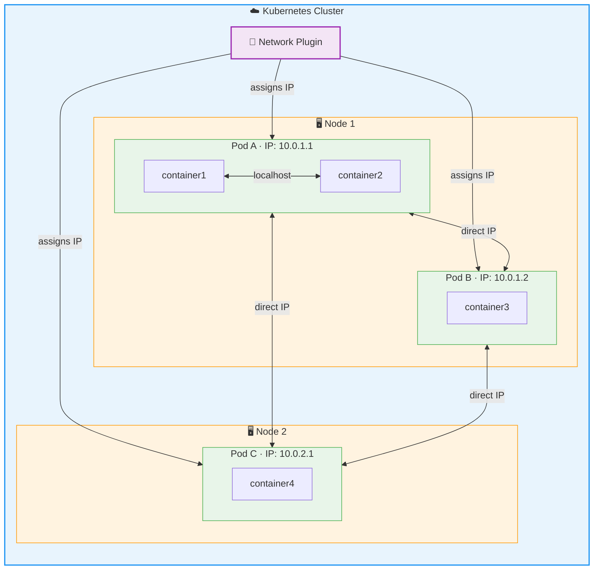
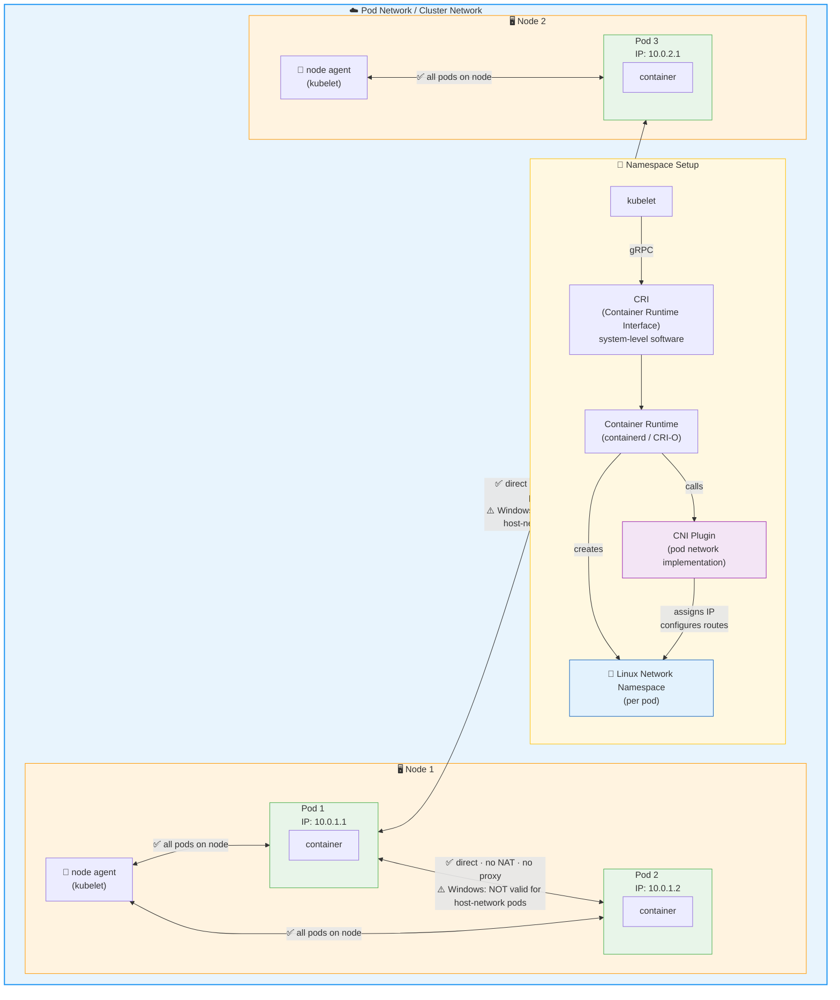

* goal
  * Kubernetes network model

* history
  * | older container systems,
    * ❌there was NO AUTOMATIC connectivity BETWEEN containers | DIFFERENT hosts❌
      * SOLUTION:
        * solution1: explicitly create links BETWEEN containers
        * solution2: map container ports -- to -- host ports
          * Reason:🧠make them reachable by containers | other hosts🧠
  * | Kubernetes
    * pods == VMs | physical hosts, about
      * port allocation
      * naming
      * service discovery
      * load balancing
      * application configuration
      * migration

- Kubernetes network model
  - characteristics
    - 💡[1! IP / EACH cluster's pod](#1-ip--each-clusters-pod)💡
    - [pod network OR cluster network](#pod-network-or-cluster-network)
    - [service proxying](#service-proxying)
    - [network policies](../../reference/glossary/network-policy.md)
    - [Gateway API](gateway)
    - [Service API](service.md)
    - [OWN private network namespace / EACH pod](#own-private-network-namespace--each-pod)
  - implementation
    - SOME are implemented by Kubernetes
    - ⚠️SOME is provided -- , through Kubernetes API, by -- other parts⚠️
  - networking implementation
    - AVAILABLE | DIFFERENT CR (Container Runtime)

## 1! IP / EACH cluster's pod

- ⚠️cluster-wide⚠️
  - != node-scope
- ❌️you do NOT need MANUALLY to❌
  - pod1 <- link -> pod2
    - == -- through -- IP
  - container’s ports <- map to -> host’s ports
  - Reason:🧠abstracted & managed by Kubernetes🧠
- 👀allocated -- by -- [network plugins](../extend-kubernetes/compute-storage-net/network-plugins.md)👀

## pod network OR cluster network

TODO: 
- Linux network namespace setup
  - system-level software implement the [CRI](../containers/cri.md)
- itself
  - managed -- by -- a [pod network implementation](../cluster-administration/addons.md#networking-and-network-policy)
    - | Linux, MOST container runtimes use  _CNI plugins_
- handle communication -- , WITHOUT using proxies OR NATs, -- BETWEEN pods /
  - node1's pod1 can communicate -- with -- node1's pod2
    - | Windows,
      - NOT valid | host-network pods
  - node1's pod1 can communicate -- with -- node2's pod2
    - | Windows,
      - NOT valid | host-network pods
- node’s agent can communicate -- with — ALL nod's pod 

## service proxying

- [kube-proxy](../../reference/glossary/kube-proxy.md)
  - default Kubernetes implementation
- SOME pod network implementations use their own service
  - Reason:🧠MORE integrated with the rest of the implementation🧠

## OWN private network namespace / EACH pod

- shared by ALL containers | pod
- pod1's container1 can communicate -- , through "localhost", with -- pod1's container2 