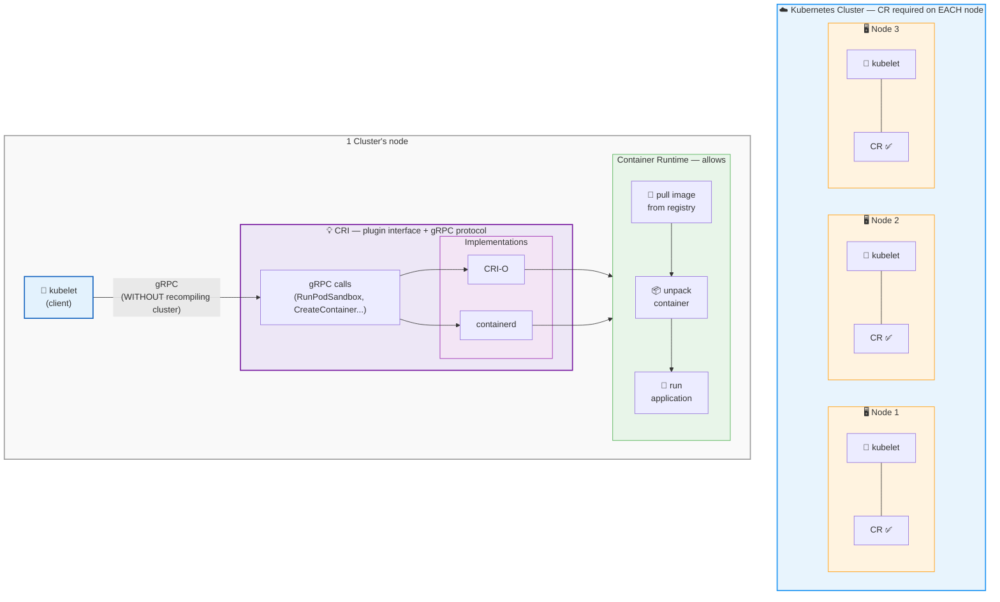

- [CRI/Container Runtime Interface](https://github.com/kubernetes/community/blob/master/contributors/devel/sig-node/container-runtime-interface.md)
  - == 💡plugin interface 💡/
    - enable
      - [Kubelet](kubelet.md) can use -- , WITHOUT recompiling the cluster components, -- MULTIPLE CR
  - == 💡[gRPC](https://grpc.io) API + protocol buffers💡
  - requirements
    - [CR](container-runtime.md) | EACH cluster's node
      - Reason:🧠kubelet can launch pod + pod's containers🧠
  - allows
    - pulling the container image — from — a registry
    - unpacking the container
    - running the application
  - implementations / supported by Kubernetes
    - [CRI-O](https://cri-o.io/#what-is-cri-o)
    - [containerd](https://containerd.io/docs/)

