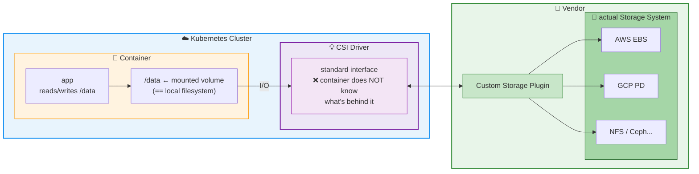

* Container Storage Interface (CSI)
  * == standard interface / expose storage systems -- to -- containers
    * == container can use a persistence storage / ❌NOT know anything about it ❌
  * enable
    * vendors can create CUSTOM storage plugins / WITHOUT adding them | Kubernetes repository
  * CSI driver
    * [AVAILABLE ones](https://kubernetes-csi.github.io/docs/drivers.html) 
    * if you want to use a CSI driver | storage provider -> steps
      * [deploy the csi driver | your cluster](https://kubernetes-csi.github.io/docs/deploying.html)
      * create a [storage class](storage-class.md) / uses that CSI driver
  * [MORE](../../concepts/storage/volumes.md#csi)

