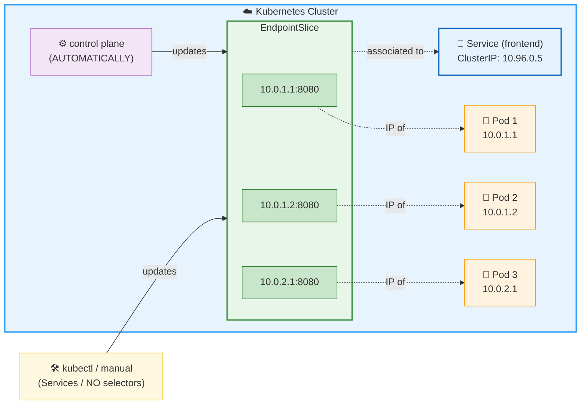

* EndpointSlice
  * := [Kubernetes Object](object.md) /
    * == 💡service's slice/subset of backend network endpoints💡 
    * != service's sub group
  * associated (NORMALLY) -- with a -- [service](service.md)
  * enable
    * services
      * are linked -- to -- Pods
      * can scale -- to -- handle LARGE number of backends
    * cluster can update its list of healthy backends
  * ways to be tracked/updated
    * AUTOMATICALLY -- by -- the control plane
    * MANUALLY -- for -- [Services](service.md) / NO [selectors](selector.md) specified

* backend network endpoints
  * == `IP:port` / receives the traffic
    * (NORMALLY) [pods](pod.md)
    * ❌ != service's ClusterIP ❌

