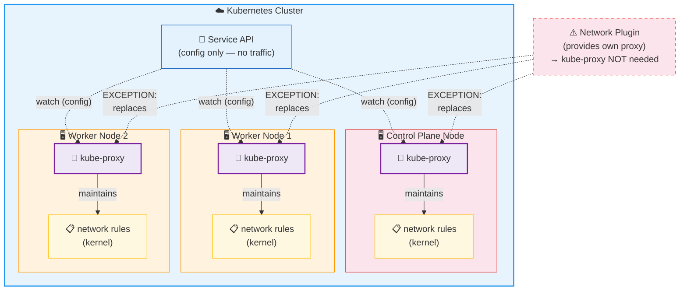
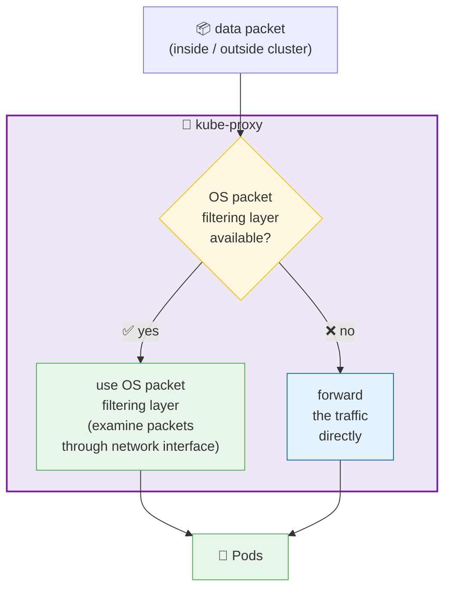
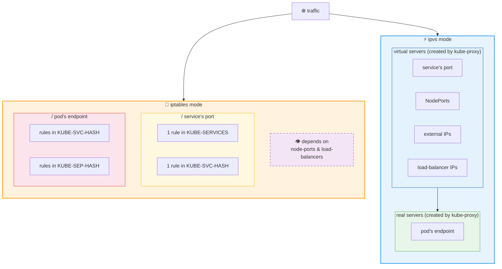

- := network proxy /
  * [overview](#overview)
  * [packet filtering layer](#packet-filtering)
  * [ALLOWED modes / it can run](#allowed-modes--it-can-run)
  * [source code](../command-line-tools-reference/kube-proxy)

## overview

* kube-proxy
  - runs | EACH cluster’s node (ALSO control plane)
    - == default one == built-in by Kubernetes
    - Reason:🧠ensure service API & associated behaviors are AVAILABLE | your cluster network🧠
    - EXCEPTION: ⚠️if you use network plugins / provide their own network proxy -> it can be replaced⚠️
  - maintains (write, read) network rules | nodes
    - enable, | network sessions inside / outside the cluster,
      - communicate -- with -- your pods
    - -> implement  [service](service.md)
  - how to be deployed | cluster?
    - -- as -- [container image](https://kubernetes.io/releases/download/#container-images)

* network sessions inside / outside the cluster
  * inside
    * cluster1's pod1 -- cluster1's service -- cluster1's pod1 
  * outside
    * external client -- cluster1's service (type = NodePort / LoadBalancer) -- cluster1's pod

## packet filtering

TODO: 
- if there is OS’ packet filtering layer -> uses it
  - packet filtering == examine data packets flowing -- through a -- network interface
  - else -> forwards the traffic

## ALLOWED modes / it can run

- Iptables mode
  - == iptables rules
    -  👁️depends on node-ports & load-balancers 👁️
    - / service’s port
      - 1 rule in `KUBE-SERVICES`
      - 1 rule in `KUBE-SVC-HASH`
    - / pod’s endpoint
      - small number rules in `KUBE-SVC-HASH`
      - small number rules in `KUBE-SEP-HASH`
- ipvs mode
  - virtual servers are created by `kube-proxy` /
    - service’s port
    - NodePorts
    - external IPs
    - load-balancer IPs
  - real servers are created by `kube-proxy` /
    - pod’s endpoint

