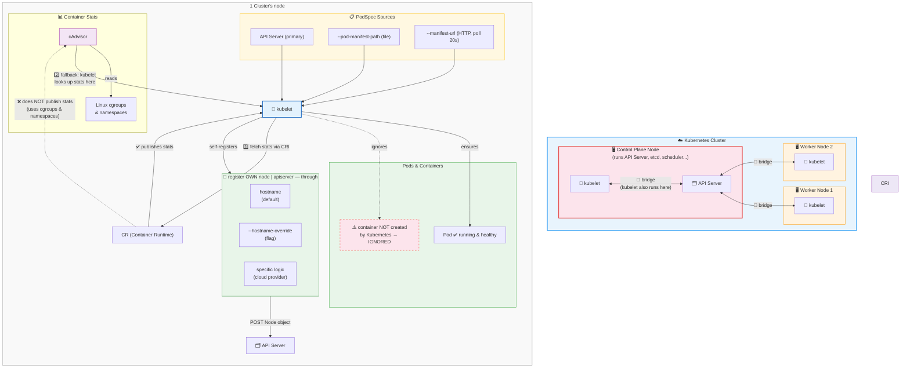

- := node agent / 
  - runs | 👁️EACH cluster's node 👁
  - responsible for
    - ensures that: containers & pods are running & healthy
      - -- based on the -- PodSpec / specified -- via --
        - API server
        - File path
          - `kubelet ... --pod-manifest-path filePath`
        - HTTP endpoint
          - `kubelet ... --manifest-url HTTPEndpoint`
      - EXCEPTION: ⚠️containers / NOT created -- by -- Kubernetes⚠️
    - fetches individual container statistics — , via CRI, from the -- [`Container Runtime`](container-runtime.md)
      - if you use a CR / implement containers -- via -- Linux cgroups & namespaces + CR does NOT publish usage statistics → kubelet look up the statistics -- via -- [cAdvisor](cadvisor.md)
    - registering it's OWN node | apiserver, -- through --
      - hostname
      - flag / override the hostname
      - specific logic -- for a -- cloud provider
    - acts as bridge BETWEEN [master node (== control plane)](control-plane.md) -- & -- rest of nodes

* PodSpec
  * == YAML OR JSON object /
    * describes a pod

