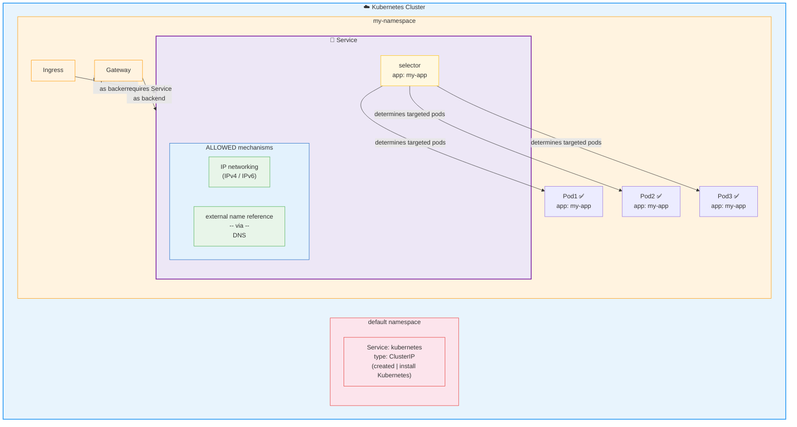

* Service
  * := method /
    * allows
      * exposing a network application / 
        * is running | >=1 cluster's podS
        * targeted set of pods is determined -- by a -- [selector](selector.md)
          * ⚠️if number of pods is changed -> set of pods / match de selector change⚠️
  * ALLOWED mechanisms
    
    | Mechanism                             | Service types                           |
    |---------------------------------------|-----------------------------------------|
    | IP networking (IPv4 / IPv6 / both)    | `ClusterIP`, `NodePort`, `LoadBalancer` |
    | External name reference -- via -- DNS | `ExternalName`                          |

  * enables: [Ingress](ingress.md) & [Gateway](gateway.md)
    * == ⚠️require a service⚠️
  * 👀default service👀
    * name: kubernetes
    * type: ClusterIP
    * | default namespace
    * created | install Kubernetes

