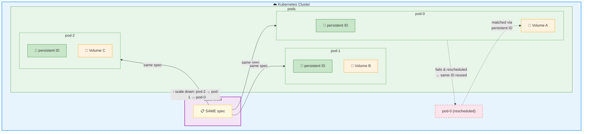

* StatefulSet
  * allows
    * managing the deployment & scaling of a set of [pods](pod.md) /
      * guarantee ordering & uniqueness / EACH pod
      * created -- from the -- SAME spec
      * NOT interchangeable
        * Reason: 🧠tracks a state🧠
      * has a persistent identifier / EACH pod
        * maintained across any rescheduling
        * -> easy to replicate
  * use cases
    * workloads / provide persistence -- via -- storage volumes
      * == ALTHOUGH pod is killed -> state is persisted
  * ALTHOUGH individual pods fail -> you can match existing volumes -- , via persistent pod identifiers, -- to the new pods

* Deployment vs StatefulSet
  
  |                      | Deployment          | StatefulSet                                                                                |
  |----------------------|---------------------|--------------------------------------------------------------------------------------------|
  | Pod identity         | random, ephemeral   | UNIQUE   &nbsp;&nbsp; SAME name   &nbsp;&nbsp; SAME DNS   &nbsp;&nbsp; SAME PV |
  | Pod creation order   | arbitrary           | sequential   &nbsp;&nbsp; _Example:_ "pod-0", "pod-1", ...                             |
  | Pod deletion order   | arbitrary           | reverse sequential   &nbsp;&nbsp; _Example:_ "pod-N", "pod-N-1", ...                   |
  | Interchangeable pods | ✅ yes              | ❌NO                                                                                        |
  | Volume               | 1 shared / ALL pods | 1 / EACH pod                                                                               |
  | Use case             | stateless workloads | stateful workloads   &nbsp;&nbsp; _ExampleS:_ DBs, queues, ...                         |
